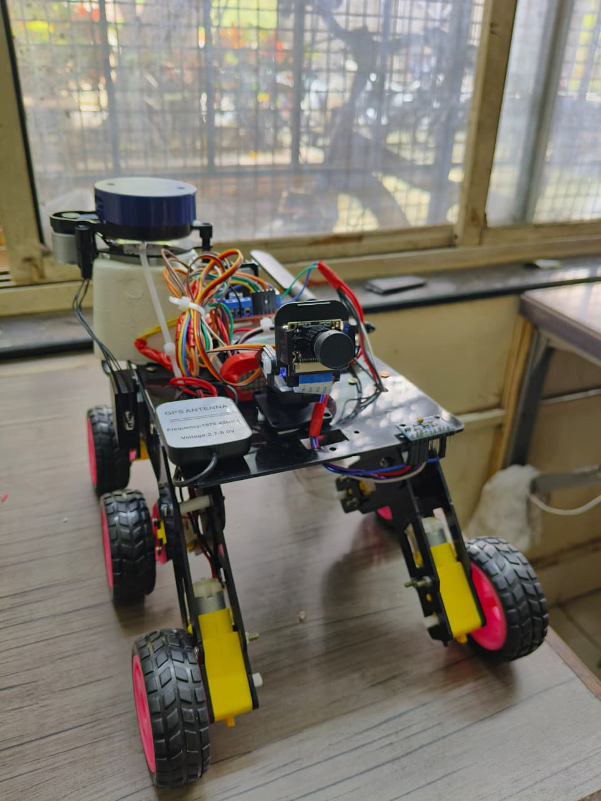
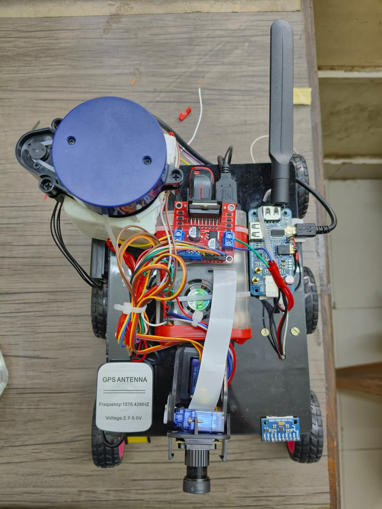
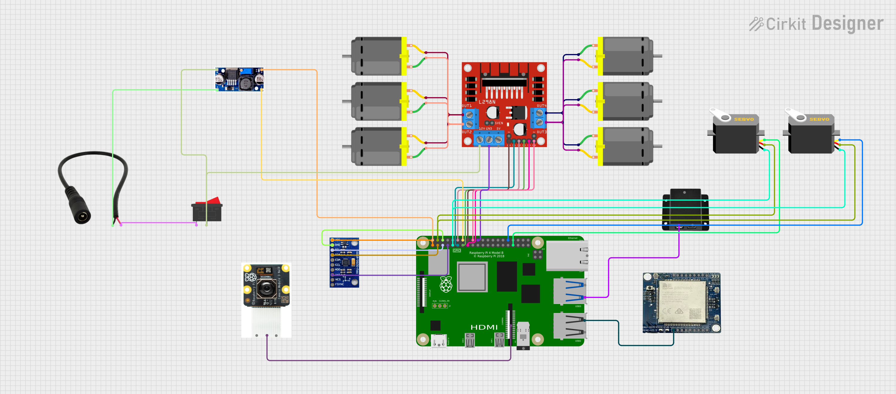
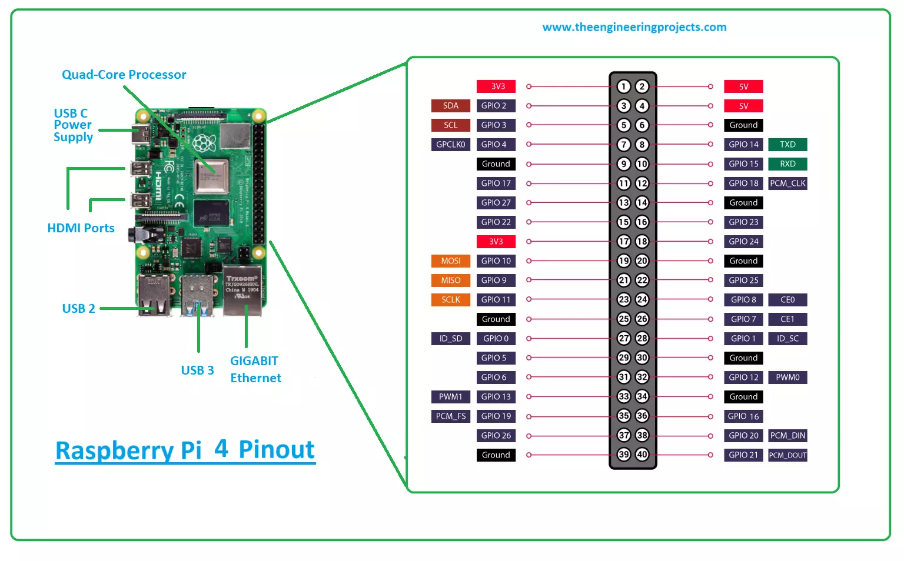

# 🤖 Autonomous Defense Surveillance Rover
### 🏆 2nd Place – Rover Domain | MindSpark'25 L&T Tech Xcelerate (COEP × Larsen & Toubro)

> A 6-wheel autonomous defense surveillance rover built on Raspberry Pi 4B, capable of waypoint navigation across diverse terrains with real-time perception, GPS-based zone mapping, and day/night operational capability — under strict compute constraints simulating real-world defense-field scenarios.

---

## 📸 Rover Photos

| Side View | Top View |
|-----------|----------|
|  |  |

---

## 🏆 Achievement

| Competition | MindSpark'25 – L&T Tech Xcelerate |
|---|---|
| Organized by | COEP Technological University, Pune × Larsen & Toubro |
| Domain | Rover – Autonomous Navigation & Battlefield Mobility |
| Result | **2nd Place in Rover Domain** · **4th Overall** (among 8 competitive teams) |

---

## 🎯 Problem Statement

**Autonomous Navigation & Battlefield Mobility – Robust Zone Mapping & Navigation Rover**

Build a rover capable of autonomous waypoint navigation across diverse terrains using highly constrained compute hardware, simulating real-world defense-field scenarios including zone mapping, obstacle avoidance, and real-time perception.

---

## ⚙️ Hardware Components

| Component | Model / Spec | Role |
|---|---|---|
| **Compute** | Raspberry Pi 4B | Central processing & autonomous logic |
| **LiDAR** | YDLIDAR X2 | 360° obstacle detection & zone mapping |
| **Motors** | 6× DC Motors | 6-wheel drive for terrain mobility |
| **Motor Driver** | L298N Dual H-Bridge | Motor speed & direction control |
| **Camera** | Raspberry Pi Camera Module | Real-time visual perception |
| **GPS** | GPS Antenna (1575.42 MHz, 2.7–5.0V) | Waypoint navigation & zone mapping |
| **IMU** | MPU-9250 | Orientation, tilt & sensor fusion |
| **Wireless** | ESP32 / WiFi Module | Remote communication & control |
| **Servo Motors** | 2× Servo | Camera pan/tilt & steering mechanism |
| **Power** | LM2596 Buck Converter + Switch | Regulated power distribution |

---

## 🔌 Circuit Overview

The Raspberry Pi 4B acts as the brain of the system. Key connections:

- **L298N Motor Driver** → controls all 6 DC motors (left and right drive groups) via GPIO PWM pins
- **MPU-6050 IMU** → connected via I2C (SDA/SCL) for real-time orientation data
- **GPS Module** → connected via UART (TX/RX) for waypoint coordinates
- **Camera Module** → connected via CSI ribbon cable for live vision
- **YDLIDAR X2** → connected via USB to Raspberry Pi for 360° real-time LiDAR scanning
- **ESP32** → connected via USB/UART for wireless communication
- **Servo Motors** → controlled via GPIO PWM for pan/tilt
- **LM2596 Buck Converter** → steps down battery voltage for stable 5V supply to Pi and sensors

---

## 🚀 Features

- **Autonomous Waypoint Navigation** — GPS-guided point-to-point traversal across outdoor terrain
- **Real-Time Sensor Fusion** — IMU + GPS combined for accurate pose estimation
- **Zone Mapping** — Maps and logs traversed regions during operation
- **Computer Vision** — Camera-based perception for obstacle detection
- **Day & Night Operation** — Functional across lighting conditions
- **Remote Communication** — ESP32-based wireless control and telemetry
- **6-Wheel Drive** — Robust mobility across uneven and rough terrain
- **Constrained Compute** — All processing on Raspberry Pi 4B with optimized algorithms

---

## 👥 Team

| Name | GitHub |
|---|---|
| Pratik Bugade | [@pratikbugade01](https://github.com/pratikbugade01) |
| Atharv Joshi | — |
| Jui Inamdar | — |
| Vaishnavi Patil | — |

> Built at D Y Patil Agriculture & Technical University, Talsande
> Competing at COEP Technological University, Pune

---

## 📄 License

MIT License
